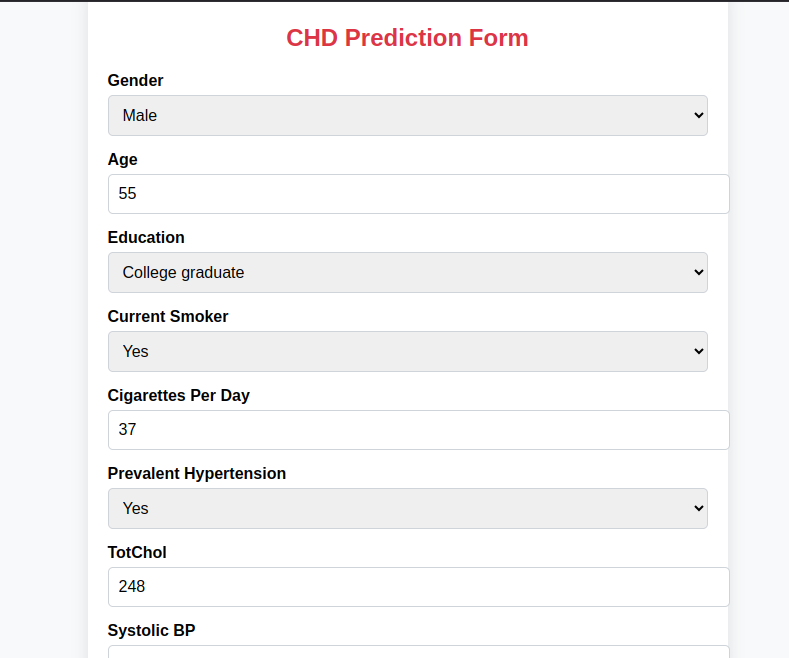

## Heart Disease Prediction - Logistic Regression
### Project Overview

This project aims to predict the 10-year risk of coronary heart disease (CHD) using logistic regression. The dataset is sourced from Kaggle and includes various health-related features. The project follows an end-to-end machine learning pipeline, from data preprocessing to model evaluation and deployment.


## Dataset Source  
The dataset used in this project is the [Framingham Heart Study dataset](https://www.kaggle.com/amanajmera1/framingham-heart-study-dataset/data) from Kaggle.  
It contains medical and lifestyle factors used to predict the 10-year risk of coronary heart disease (CHD).  

The dataset consists of the following features:

Demographics: gender, age, education
Health & Lifestyle: currentSmoker, cigsPerDay, prevalentHyp
Medical Measurements: totChol, sysBP, BMI, heartRate, glucose
Target Variable: TenYearCHD

### Project Workflow
Data Preprocessing

Handling missing values
Outlier treatment
Exploratory Data Analysis (EDA)

Visualizing feature distributions
Correlation analysis

Feature scaling
Model Development

Logistic Regression
Hyperparameter tuning
Model Evaluation

Accuracy, Precision, Recall, F1-score
Confusion Matrix
Deployment

## Web UI


## Flask API for model prediction

### How to Use
Clone the repository:

```bash
git clone https://github.com/yourusername/heart-disease-prediction.git
```
### Install dependencies:
```bash
pip install -r requirements.txt

```
### Run the Flask app:
```
python app.py
```

### Access the web interface at 
```
http://127.0.0.1:5000/
```

### Technologies Used
 - Python (Pandas, NumPy, Scikit-Learn)
 - Flask (for deployment)
 - Matplotlib & Seaborn (for visualization)

## Output


## Conclusion

This project demonstrates how logistic regression can be applied to predict heart disease risk using structured health data.


